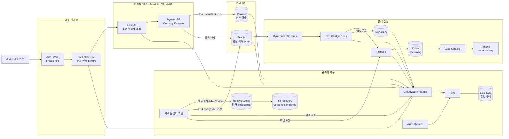

# Quiz Event AWS Portfolio

## 프로젝트 한 줄 설명

작은 퀴즈 게임의 점수와 불변 이벤트를 안전하게 저장하고, 분석 전달 장애를 탐지·복구하며, 서비스 한도와 비용 알림까지 실제 AWS에서 증명한 단일 리전 서버리스 포트폴리오입니다.

## 아키텍처

API Gateway와 WAF는 VPC 밖의 관리형 서비스입니다. Lambda만 두 비공개 서브넷에 연결되며, NAT/Internet Gateway 없이 DynamoDB Gateway Endpoint를 사용합니다.

## 실제 게임 흐름으로 설명하기

### 1. 플레이어가 퀴즈를 제출한다

API Gateway가 SigV4 요청을 받고 Lambda가 역할 ARN을 플레이어 ID로 매핑합니다. Alice 역할로 Bob을 조회하면 403입니다. 정상 제출은 Players의 최신 점수와 Events의 `QuizCompleted` 원본을 `TransactWriteItems` 한 번으로 저장합니다. 같은 요청은 원래 응답을 돌려주고, 같은 event ID의 다른 내용은 409로 거부합니다.

### 2. 분석 전달만 멈춘다

API 성공 기준은 DynamoDB 거래이므로 Pipe가 멈춰도 업무 이벤트는 Events에 남습니다. 실제 Pipe를 멈춘 실험에서 API 2건은 모두 저장됐고 Athena에는 0건이어서 누락 사용자·시간·event ID를 특정했습니다.

### 3. 정상 API가 불안정한데 복구 작업도 실행 중이다

복구 도구는 API 요청량, Lambda concurrency/throttle, DynamoDB write throttle 알람을 매 반복 전에 봅니다. ALARM이면 전송 0건 상태에서 `PAUSED`가 되고 운영자가 원인을 확인한 뒤 명시적으로 재개합니다. 자동 확장은 없습니다.

### 4. 복구 프로세스가 중간에 종료된다

RecoveryJobs에 GSI cursor와 처리 수를 저장하고 versioned S3에도 진행 증거를 남깁니다. 실제 1건 후 중단하고 재개해 총 2건을 복원했습니다. Firehose 수락과 checkpoint 사이에서 중복될 수 있으므로 `event_id`를 유지해 분석에서 dedupe합니다.

## 포트폴리오 증거

| 질문 | 구현 | 실제 증거 |
| --- | --- | --- |
| 다른 사용자 접근을 막았는가? | IAM 호출 역할 + Lambda 소유권 검사 | Alice→Bob 403 |
| 상태와 이력이 함께 저장되는가? | DynamoDB 거래 | 신규 201·재시도 200·충돌 409 |
| 분석 내용이 원본과 같은가? | Streams→Pipes→Firehose→S3→Athena | ID·hash·본문 대조 통과 |
| 분석 장애 중 원본이 남는가? | 불변 Events + recovery GSI | 통제 장애 원본 누락 0건 |
| 중단 후 이어서 처리하는가? | RecoveryJobs checkpoint | 1건 중단 후 총 2건 완료 |
| 정상 API를 보호하는가? | 알람 pause + 초당 1건 | ALARM 중 처리 0건 |
| 알림이 실제 도착하는가? | CloudWatch/Budget→SNS→SQS | 고유 시험 메시지 수신 |
| IaC와 실제 상태가 같은가? | Terraform | 최종 `No changes` |

관찰값은 분석 복구 RTO 86초, Step 8 전체 검증 139초입니다. 이는 작은 2건 실험의 값이며 서비스 수준 목표가 아닙니다.

## 비용과 과설계 방지

EKS, Redis, Kinesis Data Streams, NAT Gateway, Glue ETL, Lake Formation, 다중 리전은 사용하지 않았습니다. 현재 문제에 필요하지 않거나 개인 실습 비용과 설명 복잡도를 키우기 때문입니다. 대신 온디맨드 DynamoDB 상한, Athena 질의당 10 MiB, 월 US$20 Budget, 짧은 로그 보관을 둡니다. Budget은 강제 지출 차단이 아닙니다.

## Well-Architected 관점

| 관점 | 적용 | 남은 경계 |
| --- | --- | --- |
| 보안 | IAM 인증, 소유권 검사, 최소 권한 역할, private Lambda, S3 공개 차단 | MFA·배포 권한 축소 미완료 |
| 안정성 | 상태/이력 원자 저장, 관리형 regional 서비스, 두 AZ subnet, PITR·versioning·DLQ·재처리 | 단일 리전이며 regional DR 아님 |
| 성능 | DynamoDB 온디맨드, 직접 Firehose 전달, 병목별 알람 | 대규모 부하 시험 안 함 |
| 비용 | NAT·KDS·EKS 제외, 처리량·Athena 상한, Budget | 실제 월 청구액은 사용 후 확인 필요 |
| 운영 | Terraform, 단계별 검증, 실제 알림, drift 검사, 복구 runbook | 팀 승인·CI/CD·당직 채널 없음 |

이 표는 AWS Well-Architected Review를 완료했다는 뜻이 아니라, 개인 프로젝트에서 선택과 한계를 같은 기준으로 설명하기 위한 요약입니다.

## 면접에서 5분 설명 순서

1. 퀴즈 제출 한 건이 WAF→API→Lambda→DynamoDB 거래로 흐르는 과정을 설명합니다.
2. 현재 상태와 불변 이벤트를 분리한 이유를 `10→20→30` 예시로 말합니다.
3. 분석 Pipe 장애가 API 장애가 아닌 이유와 Events 원본의 역할을 설명합니다.
4. 실제로 찾은 결함을 말합니다: 여러 줄 NDJSON, UTC 표기 비교, Athena 최소 권한 prefix, checkpoint 조건식.
5. RPO 0건·RTO 86초가 통제 실험의 관찰값일 뿐 다중 리전 보장이 아니라고 경계를 설명합니다.

## 문서와 실행 경로

- [API·거래·권한](infra/terraform/STEP4.md)
- [이벤트 전달·Athena](infra/terraform/STEP5.md)
- [알람·비용](infra/terraform/STEP6.md)
- [제한 속도 복구](infra/terraform/STEP7.md)
- [최종 통합 검증](infra/terraform/STEP8.md)
- [전체 실행 기록](infra/terraform/VERIFICATION.md)
